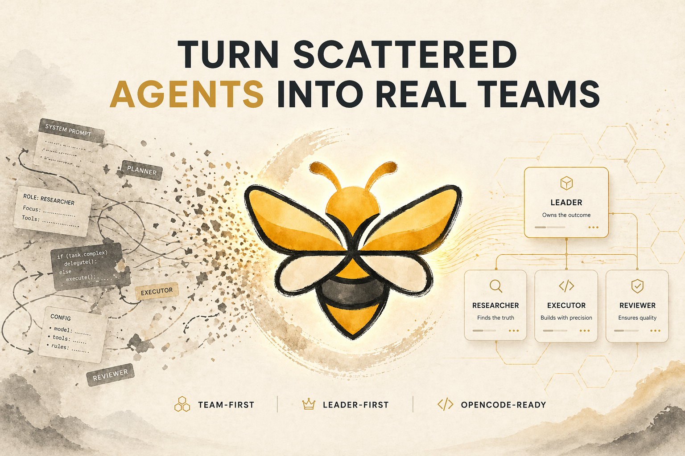

# CrewBee

[English](README.md) | [简体中文](README.zh-CN.md)

<p align="center">
  
</p>

<p align="center">
  
</p>

<p align="center"><strong>面向真实宿主运行时的 Team-first Agent 工程框架。</strong></p>

CrewBee 是一个 **Team-first（团队优先）** 的 Agent Team 框架。

它提供一套面向 Team 的定义、投影与宿主适配方式，用来把零散的 Agent prompt、规则和协作约定沉淀为可维护、可迁移、可运行的 Team 资产。

**当前重点：**让 Team 级 Agent 系统能够被稳定定义、跨宿主投影，并真正运行在 OpenCode 中。

## 为什么是 CrewBee

- **Team-first，而不是 prompt-first** —— Leader、members、workflow、policy 都是可维护的工程对象。
- **宿主无关核心** —— Team 定义不被某一个运行时绑死。
- **基于 Projection 的运行模型** —— 一套 Team 定义可以稳定映射到具体宿主。
- **今天就能接入 OpenCode** —— 已具备插件、agent 投影、安装、doctor 和 release 链路。

当前版本已经打通了 **CrewBee → OpenCode** 的完整 MVP 链路：

* Team / Agent 宿主无关定义
* Team Library 装配与校验
* Runtime Projection 与 formal leader 默认入口选择
* OpenCode agent 配置投影、别名、配置补丁与 session binding
* OpenCode 插件入口、delegation 工具、事件接线与系统提示注入
* 本地构建、用户级安装、doctor 校验与卸载流程

> 简单理解：
>
> **CrewBee = Agent Team 定义框架 + Runtime Projection 层 + 宿主适配层（当前为 OpenCode）**

## 快速入口

- [安装指南](docs/guide/installation.md)
- [发布指南](docs/guide/release.md)
- [架构文档](docs/architecture.md)

---

## 目录

* [CrewBee 是什么](#crewbee-是什么)
* [CrewBee 解决什么问题](#crewbee-解决什么问题)
* [核心特性](#核心特性)
* [安装](#安装)
* [快速开始](#快速开始)
* [当前架构一览](#当前架构一览)
* [Agent Team 与 Agent Profile 定义方式](#agent-team-与-agent-profile-定义方式)
* [OpenCode 运行时是如何工作的](#opencode-运行时是如何工作的)
* [内置 Coding Team 的设计思想](#内置-coding-team-的设计思想)
* [配置、安装与运维脚本](#配置安装与运维脚本)
* [卸载](#卸载)

---

## CrewBee 是什么

在 CrewBee 里，真正的一等对象不是单个 Agent，而是 **Team**。
一个 Team 不是几段 prompt 的拼接，而是一个有结构的定义单元，至少包含：

* Team 身份与定位
* formal leader
* members
* workflow
* Team 共享规则
* Agent Profiles
* Prompt Projection
* 宿主运行时映射

CrewBee 当前不会强行替你自动选择 Team，也不会替你自动判断“应该走什么组织结构”。
当前阶段的基本使用方式是：

* 用户在宿主中选择 Team 的入口 Agent
* CrewBee 负责把 Team 定义稳定投影到宿主中运行
* 运行时通过 session binding、delegation 与系统提示注入维持 Team 语义

---

## CrewBee 解决什么问题

CrewBee 主要解决三类问题：

### 1. 把零散 Agent 实践沉淀为可维护的 Team 资产

很多 Agent 实践仍然散落在 prompt、宿主配置和临时约定里，难以复用、迁移和长期维护。CrewBee 用 Team 定义把这些内容收敛成稳定的工程对象。

### 2. 让不同任务场景使用不同 Team，而不是一套 prompt 通吃

Coding、调研、写作、分析和流程执行的最佳行为方式并不相同。CrewBee 的核心思路是按场景定义不同 Team，而不是默认复用一套通用规则。

### 3. 让执行方式可选择、可管理

很多系统关注“能不能执行”，但较少关注“应该如何执行”。CrewBee 更强调根据任务复杂度选择合适的组织方式，并让入口、协作和运行过程更清晰。

---

## 核心特性

### 1. Team-first 静态模型

CrewBee 把 Team 当成一等对象，而不是只关心一个个散落的 agent prompt。
这意味着：

* Team 有 formal leader
* Team 有 policy
* Team 有 members 和 workflow
* Team 有宿主无关骨架

### 2. 宿主无关的 Runtime Projection

CrewBee 先把 Team-first 结构转换成统一的中间表示，再映射到具体宿主。
这让 Team / Agent 的定义尽量保持宿主无关，适合长期维护和后续扩展。

### 3. OpenCode 适配器与插件运行时

当前已经打通 Team / Agent 定义到 OpenCode 可运行 Agent 的完整投影链路，包括：

* projected agent → OpenCode agent config
* Team / Agent prompt 构造
* config patch 输出
* 宿主事件接入
* delegation 工具挂接

### 4. Prompt 既低耦合，又保留执行语义

CrewBee 没有回退到“每个字段一个 schema / 一个 renderer”的旧路，也没有退化成“top-level block 全透明 dump”。

当前采用的是：

> **少量公共语义骨架 section + 通用结构处理 + 结构渲染**

例如 Agent prompt 的骨架顺序会围绕执行心智组织：

* Persona Core
* Responsibility Core
* Core Principle
* Scope Control
* Ambiguity Policy
* Support Triggers
* Collaboration
* Task Triage
* Delegation & Review
* Todo Discipline
* Completion Gate
* Failure Recovery
* Operations
* Output Contract
* Templates
* Guardrails
* Heuristics
* Anti Patterns
* Tool Skill Strategy

这样模型更容易快速建立：

* 我是谁
* 我负责什么
* 我默认怎么行动
* 什么时候委派 / 评审 / 提问 / 停下
* 完成标准是什么
* 失败时如何恢复

### 5. Collaboration 会生成可直接委派的 Agent 清单

当前生成的 `Collaboration` 不再只是简单列 profile 里的协作绑定，而是会结合：

* Agent Profile 中声明的合作 subagent 列表
* Team Manifest 中的 `members` 描述
* OpenCode 侧可解析的 projected id

从而在 prompt 中生成：

* `Id`
* `Description`
* `When To Delegate`

便于在运行时直接委派。

### 6. Team Contract 压缩为可执行手册

Team prompt 最终不是直接渲染整块治理配置，而是收敛为：

* `Working Rules`
* `Approval & Safety`

这让 Team 合同更适合模型消费，也避免了治理字段机械展开。

### 7. 用户级安装与运维链路

CrewBee 已经具备完整的本地构建、用户级安装、doctor 校验和卸载链路，能够作为 OpenCode 的用户级插件稳定接入。

---

## 安装

### 给人类的最短路径

如果你在用 LLM Agent，直接把下面这段发给它：

```text
请按照当前仓库中的 docs/guide/installation.md 完成 CrewBee 安装。
只使用 OpenCode 用户级安装流程，不要使用旧的 project-local 安装方式。
```

或者你自己阅读：

* [安装指南](docs/guide/installation.md)

### 给 LLM Agent 的最短路径

直接读取并执行：

```text
docs/guide/installation.md
docs/guide/release.md
```

### Windows 一键本地安装脚本

仓库已经提供：

```bat
scripts\install-local-user.bat
```

它会自动执行：

1. `npm install`
2. `npm run install:local:user`
3. `npm run doctor`

---

## 快速开始

### 开发构建

```bash
npm install
npm run typecheck
npm run build
```

### 本地用户级安装

推荐从仓库根目录执行：

```bash
npm install
npm run install:local:user
```

这会做四件事：

1. 构建 CrewBee
2. 打包稳定本地 tarball 到 `.artifacts/local/crewbee-local.tgz`
3. 安装到 OpenCode 用户级 package workspace（`~/.cache/opencode`）
4. 重写 OpenCode config 为 canonical 插件入口 `crewbee`

### 已发布后的 registry 安装

当 `crewbee` 发布到 npm 后，可以直接执行：

```bash
npm run install:registry:user
```

OpenCode 配置也可以直接写插件包名：

```json
{
  "plugin": ["crewbee"]
}
```

### 验证安装

```bash
npm run doctor
npm run version
```

`npm run version`（或 `crewbee version`）会直接从 `package.json` 读取当前包版本和已安装包版本。

### 在 OpenCode 中使用

安装完成后：

1. 打开任意项目
2. 选择 CrewBee 投影出的 agent（例如 `[CodingTeam]leader`）
3. 正常发送请求

---

## 当前架构一览

```text
Team Definitions
  -> TeamLibrary
  -> TeamLibrary Projection
  -> OpenCode Bootstrap
  -> OpenCode Config Patch + Session Binding
  -> OpenCode Plugin Hooks

User-level install
  -> local tarball
  -> ~/.cache/opencode
  -> node_modules/crewbee
  -> canonical package-name entry (crewbee)
  -> OpenCode config
```


## Agent Team 与 Agent Profile 定义方式

### 文件型 Team 的实际结构

当前真实可运行的文件型 Team 结构是：

```text
teams/<team-name>/
  team.manifest.yaml
  team.policy.yaml
  <agent>.agent.md
  <agent>.agent.md
  TEAM.md            # 可选
```

当前实现采用 **同级扁平目录**；不要求 `agents/` 或 `docs/` 子目录。

### `team.manifest.yaml`

负责：

* Team 身份
* mission / scope
* formal leader
* members
* workflow
* agent runtime 覆写
* tags

其中，`members` 不只是展示字段。它会影响：

* Team 结构校验
* Team 运行时描述
* Collaboration prompt 输出

因此，`members.<agent>.responsibility / delegate_when / delegate_mode` 是关键字段，而不是说明性装饰。

### `team.policy.yaml`

负责：

* instruction precedence
* approval policy
* forbidden actions
* quality floor
* working rules

并最终压缩成 Team Contract 的两个 section：

* `Working Rules`
* `Approval & Safety`

### `*.agent.md`

负责定义单个 Agent 的静态画像，包括：

* 这个 Agent 是怎样的做事者
* 这个 Agent 负责什么
* 这个 Agent 的边界是什么
* 这个 Agent 默认如何协作
* 这个 Agent 运行时需要哪些工具和权限
* 这个 Agent 默认怎样输出结果

CrewBee 推荐直接把关键执行语义定义为顶层 section，例如：

* `persona_core`
* `responsibility_core`
* `core_principle`
* `scope_control`
* `ambiguity_policy`
* `support_triggers`
* `collaboration`
* `task_triage`
* `delegation_review`
* `todo_discipline`
* `completion_gate`
* `failure_recovery`
* `operations`
* `output_contract`
* `templates`
* `guardrails`
* `heuristics`
* `anti_patterns`
* `tool_skill_strategy`

### 当前能力定义路径

当前能力定义的主要落点是：

* **Agent 级能力**：`*.agent.md` 里的 `runtime_config`
* **Team 级运行时覆盖**：`team.manifest.yaml` 里的 `agent_runtime`
* **宿主侧可用能力**：adapter / host capability contract

### `TEAM.md`

`TEAM.md` 是面向人的 Team 说明文档。
它的作用是帮助快速理解：

* 这个 Team 是干什么的
* Leader 是谁
* 成员分别做什么
* 默认 Workflow 是什么

但它不是 source of truth。
真正的逻辑来源仍然是：

* `team.manifest.yaml`
* `team.policy.yaml`
* `*.agent.md`

### Prompt Projection

当前支持：

```yaml
prompt_projection:
  include:
    - persona_core
    - responsibility_core.description
  exclude:
    - metadata.tags
  labels:
    delegation_review: Delegation & Review
```

约束：

* 只允许 `snake_case` path
* 不支持 `projection_schema`
* 不支持 camelCase path

---

## OpenCode 运行时是如何工作的

当前 OpenCode 插件链路大致如下：

```text
package.json
  -> opencode-plugin.mjs
  -> dist/opencode-plugin.mjs
```

### 插件初始化时会做什么

1. 加载默认 Team Library
2. 校验 Team Library
3. 生成 bootstrap 结果
4. 生成 alias index
5. 初始化 session binding store
6. 初始化 delegation state store

### 关键 Hook

#### `config`

把 CrewBee projected agents 注入 OpenCode config。

#### `chat.message`

读取用户当前选择的 agent，并建立 CrewBee 视角下的 session binding。

#### `tool` / delegation tools

注册：

* `delegate_task`
* `delegate_status`
* `delegate_cancel`

#### `tool.execute.before`

把 `task` 的 `subagent_type` 从别名重写成 projected config key。

#### `experimental.chat.system.transform`

向系统提示注入最小 CrewBee 运行时说明：

* Team
* Entry Agent
* Active Owner
* Mode

---

## 内置 Coding Team 的设计思想

CrewBee 当前最重要的方法论样板，就是内置 Coding Team。

它的核心判断包括：

### 1. Leader 不等于 Planner，不等于纯 Orchestrator

Leader 是默认入口、主链路 owner 和最终收口责任人。
但 Leader 不被预设为“只能编排、不能执行”的角色。

### 2. 最值得独立出去的通常不是 Planner，而是 Reviewer

在 Coding 场景里，计划、执行、验证是强耦合回路。
真正值钱的是：

* 上下文连续性
* 端到端责任闭环
* 独立质量视角

所以，更稳定的结构通常是：

* 主执行 owner
* research
* reviewer
* 必要时的 advisor

而不是 O / P / E 三权平分。

### 3. 简单任务不强制复杂协作，难题也不默认走重仪式

CrewBee 认为：

* **简单任务** 应该轻
* **极难问题** 应该尽量保持上下文集中、试错快速、人类主导清晰
* **复杂但常规的工程任务** 才更适合 Team 协作结构化介入

### 4. 主执行 owner + research + review 是当前更重要的样板结构

对于代码任务，CrewBee 当前更强调：

* formal leader 不等于纯管理者
* 主执行 owner 可以长期持有主上下文
* 专项研究、评审、顾问按需插入
* reviewer 独立存在，质量视角独立于主执行链路

---

## 配置、安装与运维脚本

### 常用脚本

```bash
npm run build
npm run typecheck
npm run test
npm run pack:local
npm run pack:release
npm run release:registry:dry-run
npm run install:local:user
npm run install:registry:user
npm run doctor
npm run uninstall:user
npm run simulate:opencode
npm run simulate:compact
```

### 说明

* `build`：构建产物
* `typecheck`：执行 TypeScript 类型检查
* `test`：运行测试
* `pack:local`：打包本地 tarball
* `pack:release`：打包版本化 release tarball
* `release:registry:dry-run`：在本地执行 registry 发布预检但不真正发布
* `install:local:user`：执行完整用户级安装
* `install:registry:user`：把已发布的 npm 包安装到用户级 workspace
* `doctor`：校验 OpenCode 配置与安装状态
* `version`：显示当前包版本与已安装包版本
* `uninstall:user`：卸载用户级安装
* `simulate:opencode`：运行本地 OpenCode runtime simulator
* `simulate:compact`：运行 compact 场景验证脚本

### 用户级 workspace 默认路径

```text
Config root:  ~/.config/opencode
Install root: ~/.cache/opencode
```

Canonical 插件入口：

```text
crewbee
```

发布手册：

```text
docs/guide/release.md
```

Windows 下默认仍优先使用：

```text
~/.config/opencode
```

若已有 OpenCode 配置位于 `%APPDATA%/opencode`，则会按现有配置位置回退兼容。

---

## 卸载

推荐使用：

```bash
npm run uninstall:user
```

它会：

* 从 OpenCode config 中移除 CrewBee 插件入口
* 从用户级 workspace 中移除安装包

如果你只想验证是否已经卸载干净，可再运行：

```bash
npm run doctor
```
