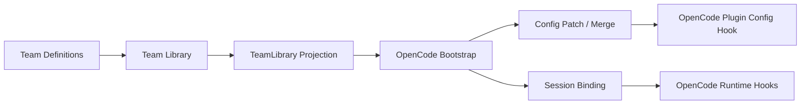
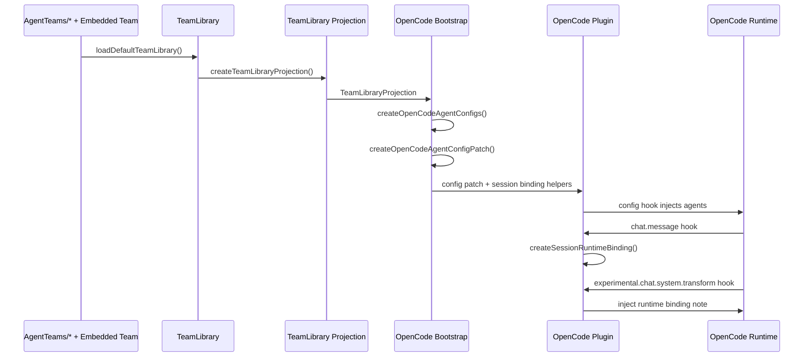

# CrewBee 架构文档

## 1. 文档定位

本文档描述当前仓库里已经落地的 CrewBee 架构与实现。

它回答四个问题：

1. CrewBee 现在到底是什么
2. 当前代码分成哪几层
3. 程序从 Team 定义到 OpenCode 插件运行时是怎么流动的
4. 哪些能力已经实现，哪些仍是后续扩展点

如果某项内容没有在代码里落地，本文档会明确标注为“未实现”或“预留”。

---

## 2. 当前实现的一句话定义

当前版本的 CrewBee 可以概括为：

**一个 Team-first 的 Agent 定义与投影框架，已经打通从 Team Library 到 OpenCode 插件运行时的 MVP 链路。**

更具体地说，当前仓库已经实现：

- Team / Agent 的宿主无关静态契约
- 内置 Team 与文件型 Team 的统一装配
- Team-first 到 Agent-first 的宿主无关投影，并支持 formal leader 默认入口与 `selectionPriority` 排序语义
- OpenCode Agent 配置生成、配置合并、命名空间隔离与默认 agent 安全更新
- OpenCode 插件入口、会话绑定、系统提示注入、delegation 工具、事件驱动后台状态与 compaction continuity

当前仓库尚未实现：

- 面向多个宿主的并行运行时实现
- 完整且宿主无关的 Team-collaboration 执行引擎
- 独立的 Manager 产品入口

---

## 3. 一屏看懂当前架构



把它翻译成代码目录，就是：

| 层 | 作用 | 主要目录 / 文件 |
| --- | --- | --- |
| Core Contracts | 定义宿主无关的 Team / Agent / Runtime 合同 | `src/core/index.ts` |
| Team Library | 装配内置 Team 与文件型 Team | `src/agent-teams/*` |
| Runtime Projection | 生成 TeamLibrary Projection 和 Session Binding | `src/runtime/team-library-projection.ts`, `src/runtime/types.ts` |
| Host Adapter | 把投影结果映射到 OpenCode | `src/adapters/opencode/*` |
| Plugin Entry | 让 OpenCode 真正加载 CrewBee | `src/adapters/opencode/plugin.ts`, `opencode-plugin.mjs`, `package.json` |

---

## 4. 分层设计

### 4.1 `src/core`：宿主无关的事实来源

`src/core/index.ts` 是当前工程的基础契约层。

这里定义：

- Team manifest / mission / scope / workflow
- Team policy / approval / quality floor / working rules
- agent profile / persona / responsibility / collaboration
- entry point / capabilities / output contract
- Team selection / execution plan / runtime snapshot / runtime event
- host capability contract

其中当前已经落地到运行时的重要 entry-point 语义包括：

- `leader.agentRef`：定义 Team 的 formal leader
- `entryPoint.exposure`：定义 agent 是否对用户暴露
- `entryPoint.selectionPriority`：定义同一角色组内的排序优先级（数字越小越靠前）

这一层的关键特征是：

- 不依赖具体宿主
- 不做 IO
- 不做配置扫描
- 不知道 OpenCode 的任何细节

它解决的是“CrewBee 自己的语言是什么”。

### 4.2 `src/agent-teams`：把静态 Team 资产装配成 TeamLibrary

这一层把 Team 资产组织成统一的 `TeamLibrary`。

关键文件：

- `src/agent-teams/library.ts`：装配默认 Team 库
- `src/agent-teams/filesystem.ts`：从磁盘发现 Team 目录
- `src/agent-teams/parsers.ts`：解析 manifest / agent profile / policy
- `src/agent-teams/validation.ts`：校验 Team 结构与语义
- `src/agent-teams/embedded/coding-team.ts`：内置 `CodingTeam`

当前的 Team 来源有两类：

1. 内置 Team：`CodingTeam`
2. 文件型 Team：`AgentTeams/*`

当前文件型 Team 的标准结构为：

```text
<team-id>/
  team.manifest.yaml
  team.policy.yaml
  agents/
    *.agent.md
```

其中 `team.policy.yaml` 在当前实现中已经是必需项。

当前默认装配逻辑很直接：

```text
loadDefaultTeamLibrary()
  = createEmbeddedCodingTeam()
  + loadTeamLibraryFromDirectory(AgentTeams/)
```

### 4.3 `src/runtime`：宿主无关的中间投影层

这一层不执行 agent，也不操作 OpenCode 配置。
它只负责把 Team-first 数据变成 adapter 可继续消费的中间结构。

关键文件：

- `src/runtime/team-library-projection.ts`
- `src/runtime/types.ts`

这一层当前做两件核心事情：

1. **TeamLibrary Projection**
   - 把 `TeamLibrary` 展开成所有 Team、Agent、入口暴露信息
   - 对投影顺序执行稳定规则：formal leader 在前，其余按 `selectionPriority`，最后按原声明顺序兜底
   - 计算默认 user-selectable agent：formal leader 若可选则优先，否则取排序后的第一个可选 agent
   - 结果类型是 `TeamLibraryProjection`

2. **Session Binding**
   - 根据 `teamId + sourceAgentId + mode + source` 生成会话绑定结果
   - 结果类型是 `SessionRuntimeBinding`

它解决的是：“把 Team-first 世界翻译成 adapter 能接得住的中间表示”。

### 4.4 `src/adapters`：宿主适配公共边界

`src/adapters/index.ts` 是宿主适配层的公共边界。

这里定义：

- `AdapterDefinition`
- `TeamRuntimeBinding`
- `AdapterRunContext`
- `AdapterRuntimeView`

它的职责不是实现 OpenCode，而是定义“宿主适配器”应该长什么样。

### 4.5 `src/adapters/opencode`：当前唯一已实现的宿主适配器

这是目前最重要的已实现宿主层。

文件职责如下：

| 文件 | 职责 |
| --- | --- |
| `src/adapters/opencode/bootstrap.ts` | OpenCode 适配主装配入口，生成 config patch、merge 结果、collision 结果、session binding |
| `src/adapters/opencode/plugin.ts` | 真正的 OpenCode 插件运行时入口，实现 hooks |
| `src/adapters/opencode/projection.ts` | 把 `TeamLibraryProjection` 中的 agent 投影成 OpenCode agent config |
| `src/adapters/opencode/config-merge.ts` | 把 CrewBee 生成的 agent config 合并回宿主配置 |
| `src/adapters/opencode/coexistence.ts` | foreign agents 冲突检测与命名空间策略 |
| `src/adapters/opencode/permission-mapper.ts` | CrewBee permission 规则到 OpenCode permission 结构的映射 |
| `src/adapters/opencode/prompt-builder.ts` | OpenCode agent prompt 的生成 |
| `src/adapters/opencode/capabilities.ts` | 当前 OpenCode 宿主能力声明 |
| `src/adapters/opencode/tool-domain.ts` | CrewBee plugin tools 的 OpenCode 视角计划 |

其中 prompt 生成路径在当前实现中已经是结构化主链路，不依赖外部 projection schema，也不依赖字段专属 renderer。

### 4.6 `src/manager`：内部状态辅助层

`src/manager/index.ts` 目前不是用户入口，而是纯函数式的内部辅助层。

它当前负责：

- 管理 Team 是否启用
- 管理当前选择的 Team 和 mode
- 生成最小 `TeamExecutionPlan`
- 维护 `RuntimeSnapshot`

它解决的是“内部状态组织”，不是“产品入口”。

---

## 5. 从 Team 到 OpenCode 的端到端流程

### 5.1 流程总览



### 5.2 阶段 1：加载 TeamLibrary

入口：`src/agent-teams/library.ts`

步骤：

1. 扫描 `AgentTeams/` 下的文件型 Team
2. 解析 manifest / policy / agent profile
3. 校验结构与语义
4. 把内置 `CodingTeam` 放到默认库中
5. 输出 `TeamLibrary`

输出对象：`TeamLibrary`

### 5.3 阶段 2：做 TeamLibrary Projection

入口：`src/runtime/team-library-projection.ts`

步骤：

1. 遍历每个 Team
2. 按 formal leader / `selectionPriority` / 原声明顺序生成稳定 agent 顺序
3. 把每个 Agent 转成 `ProjectedAgent`
3. 标记 leader / member
4. 标记 `user-selectable` / `internal-only`
5. 汇总成 `TeamLibraryProjection`

输出对象：

- `TeamLibraryProjection`
- `ProjectedTeam`
- `ProjectedAgent`

### 5.4 阶段 3：做 OpenCode Bootstrap

入口：`src/adapters/opencode/bootstrap.ts`

这是 OpenCode 适配层最重要的静态装配主流程。

核心步骤：

1. 接收 `TeamLibrary`
2. 生成 `TeamLibraryProjection`
3. 通过 `createOpenCodeAgentConfigs()` 生成 OpenCode agent config 草图
4. 检查命名冲突和 foreign agent 冲突
5. 过滤掉不安全的投影结果
6. 计算默认入口 agent（优先 formal leader）
7. 生成 `configPatch`
8. 如果拿到了宿主现有配置，就做 merge
9. 如果拿到了 `sessionID` 和选中 agent，就生成 `SessionRuntimeBinding`

另外，在 prompt 生成阶段，当前实现还会做一个重要增强：

- `Collaboration` 不仅来自 Agent Profile 声明的合作 subagent 列表；
- 还会结合 `team.manifest.members` 的 `responsibility` 与 `delegateWhen`；
- 并使用 OpenCode 运行时实际可解析的 projected config key 作为 `Id` 暴露给模型。

这样生成出来的 Collaboration 更接近可直接委派的 agent 清单，而不是单纯的角色文本描述。

输出对象：`OpenCodeBootstrapOutput`

关键输出字段：

- `projectedAgents`
- `configPatch`
- `mergedConfig`
- `mergeResult`
- `collisions`
- `sessionBinding`

### 5.5 阶段 4：OpenCode 插件运行时接线

入口：`src/adapters/opencode/plugin.ts`

当前 OpenCode 插件已经接入 9 个真实 hook / hook 组：

1. `config`
   - 调用 `createOpenCodeBootstrap()`
   - 把 CrewBee 投影的 agents 写入 `cfg.agent`
   - 在安全条件满足时写入 `default_agent`

2. `tool`
   - 注册 `delegate_task` / `delegate_status` / `delegate_cancel`

3. `event`
   - 消费 session 事件，驱动 background delegation 状态与 continuity 恢复

4. `chat.message`
   - 根据当前选中的 OpenCode agent 找到对应 CrewBee entry agent
   - 生成 `SessionRuntimeBinding`
   - 存入当前插件运行时的 `bindings` map

5. `tool.definition`
   - 给 OpenCode 原生 `task` 补充 CrewBee alias 提示

6. `tool.execute.before`
   - 把 CrewBee alias 重写成 projected config key

7. `tool.execute.after`
   - 对 delegation 结果做结果 hardening

8. `experimental.chat.system.transform`
   - 根据 `sessionID` 找回 binding
   - 注入最小运行时说明：Team、Entry Agent、Active Owner、Mode

9. `experimental.session.compacting`
   - 注入 continuity context，并为后续恢复保留 checkpoint / todo 摘要

这条链路说明：

- CrewBee 已经不是“只有静态 config patch”
- 它已经真实接到了 OpenCode 插件运行时
- 但它目前仍然是 **有 delegation 闭环的最小运行时治理链路**，不是完整且宿主无关的多 Agent 执行引擎

### 5.6 阶段 5：包入口与宿主加载

入口文件：

- `opencode-plugin.mjs`
- `package.json`

当前发布入口的角色分工是：

- `src/adapters/opencode/plugin.ts`：源码级插件实现
- `dist/src/adapters/opencode/plugin.js`：编译产物
- `opencode-plugin.mjs`：包根 shim，给 OpenCode 提供稳定入口
- `package.json`：把包根导向 `opencode-plugin.mjs`

---

## 6. 当前最重要的数据结构

### 6.1 `TeamLibrary`

来源：`src/core/index.ts`

表示当前可用的 Team 集合，是静态 Team 世界的总入口。

### 6.2 `TeamLibraryProjection`

来源：`src/runtime/types.ts`

表示运行时投影目录。
它把 Team-first 结构转换成 adapter 更容易消费的 Agent-first 目录。

### 6.3 `SessionRuntimeBinding`

来源：`src/runtime/types.ts`

表示某个会话当前绑定到了哪个 Team、哪个入口 agent、哪个 mode、哪个 active owner。

### 6.4 `OpenCodeAgentConfig`

来源：`src/adapters/opencode/projection.ts`

表示 CrewBee 中间投影结果对应的 OpenCode agent config 草图。

### 6.5 `OpenCodeBootstrapOutput`

来源：`src/adapters/opencode/bootstrap.ts`

表示 OpenCode 适配静态装配主流程的总输出。

---

## 7. 当前 OpenCode MVP 到底能做什么

已经实现：

- 真实插件入口
- Team-first 到 OpenCode Agent-first 的投影
- config 注入
- `default_agent` 安全更新
- 命名空间与 collision 处理
- formal leader 默认入口与 `selectionPriority` 排序语义
- 最小会话绑定
- 最小系统提示注入
- delegation 三件套工具
- background delegation 状态跟踪
- compaction continuity 与 todo 恢复提示
- OpenCode 原生 `task` alias 兼容层

尚未实现：

- 宿主无关的 Team-collaboration 运行时编排
- 多宿主并行适配
- 独立 Manager UI / CLI
- 宿主侧完整运行时间线

## 7.1 关于 OpenCode 列表排序的边界

虽然 CrewBee 会产出稳定的 projected agent 顺序，并明确计算默认入口 agent，但 OpenCode 最终的可见列表顺序仍由宿主决定。

当前实现下，CrewBee **可靠控制的是**：

- 哪个 agent 成为 `default_agent`
- projected agent 的名字和元数据
- runtime projection 的内部顺序与默认选择语义

而 OpenCode 的最终 UI 列表顺序会继续受宿主自身规则影响。因此文档中的“优先级排序”应理解为 CrewBee 的投影与默认选择语义，而不是对宿主 UI 排序的绝对接管。

---

## 8. 当前目录结构的理解方式

```text
src/
  core/                   # 宿主无关合同
  agent-teams/            # Team 发现、解析、校验、装配
  runtime/                # 宿主无关投影与绑定
  adapters/
    index.ts              # 宿主适配公共边界
    opencode/             # OpenCode 适配实现
  manager/                # 内部状态辅助层

AgentTeams/               # 文件型 Team 资产
docs/                     # 架构与流程文档
opencode-plugin.mjs       # OpenCode 包根入口
package.json              # 发布入口与依赖
```

理解规则可以简化成一句话：

**core 定义 CrewBee 语言，agent-teams 组装 TeamLibrary，runtime 生成中间投影，adapters/opencode 把它接到真实宿主。**

---

## 9. 文档阅读建议

如果你想快速进入代码：

1. 先看 `README.md`
2. 再看本文件 `docs/architecture.md`
3. 然后看 `docs/opencode-runtime-flow.md`
4. 最后按下面顺序读代码：
   - `src/core/index.ts`
   - `src/agent-teams/library.ts`
   - `src/runtime/team-library-projection.ts`
   - `src/adapters/opencode/bootstrap.ts`
   - `src/adapters/opencode/plugin.ts`

这条阅读路径最接近程序的真实流向。
