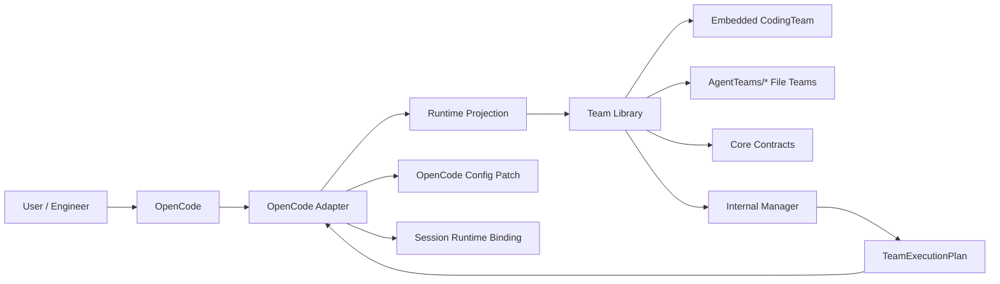
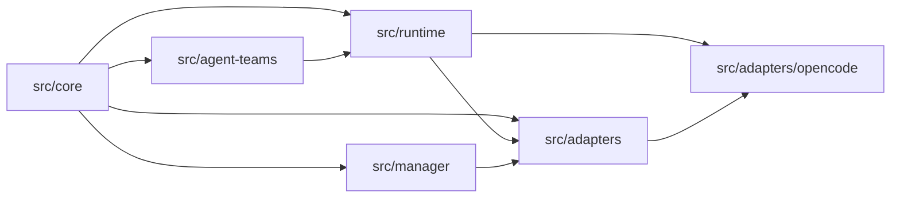
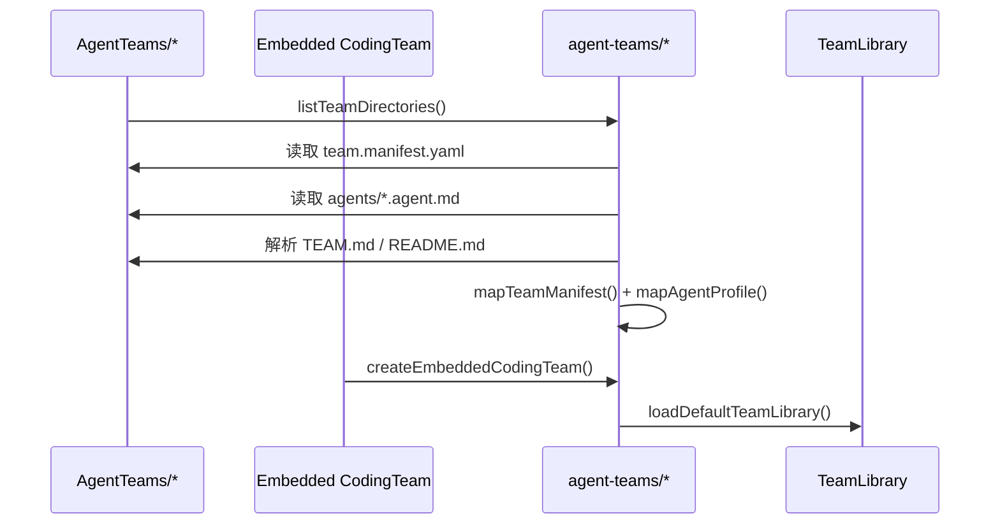
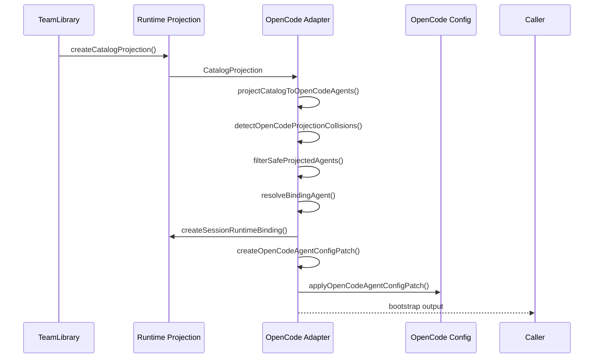

# AgentScroll 架构文档

## 1. 文档定位

本文档是 AgentScroll 当前工程实现的唯一架构总览，取代原有的 `docs/框架总览.md`。

它只描述两类内容：

- 已经在仓库中落地的实现
- 已经在代码中明确预留、但尚未打通的扩展点

除非显式标注“未实现”或“预留”，本文档不描述纯设计意图。

---

## 2. 当前版本的系统定位

AgentScroll 当前实现的是一个 **Agent Team 配置管理框架 + OpenCode 适配骨架**。

它已经完成的核心闭环不是“多 Agent 运行时执行引擎”，而是：

1. 定义 Team / Agent 的宿主无关静态契约
2. 从内置 Team 与文件型 Team 组装 Team Library
3. 对 Team Library 做结构化解析与校验
4. 把 Team-first 定义投影为 OpenCode 可消费的 Agent 配置
5. 生成 OpenCode 配置补丁、默认入口和会话绑定结果

因此，当前工程更准确的公式是：

```text
AgentScroll = Team Definitions + Team Library + Runtime Projection + OpenCode Adapter + Internal Manager
```

对应到项目书中的 V1 收束公式，当前代码已经跑通的是：

```text
AgentScroll = Agent Team × Manager × Adapter
```

但需要注意：

- `Manager` 当前是内部状态与默认值辅助层，不是独立产品入口
- `Adapter` 当前以 OpenCode 为唯一已实现宿主
- 运行时“真正执行多 Agent 工作流”的 hook plane 尚未打通

---

## 3. 架构原则与代码落点

下表把内部方法论与当前代码实现对齐。

| 原则 | 当前含义 | 主要代码落点 |
| --- | --- | --- |
| Team-first | Team 是静态事实来源，Agent 属于 Team 内部结构 | `src/core/index.ts`, `src/agent-teams/*` |
| 宿主无关核心 | Team / Agent / Governance / Runtime Binding 先在核心层建模 | `src/core/index.ts` |
| 混合 Team 来源 | 默认库 = 内置 `CodingTeam` + 文件型 `AgentTeams/*` | `src/agent-teams/library.ts` |
| 结构化 Agent Profile | Agent 不再是一坨 prompt，而是结构化 Profile + 正文规则 | `src/agent-teams/parsers.ts` |
| Team 投影到 OpenCode | Team-first 定义通过 Catalog Projection 转换为 Agent-first 宿主对象 | `src/runtime/assembler.ts`, `src/adapters/opencode/projection.ts` |
| OpenCode 原生入口优先 | 用户继续用 OpenCode 的 agent/model/config 入口 | `src/adapters/opencode/plugin.ts` |
| 共存而不依赖 OMO | 命名空间隔离、不改 foreign agents、不抢默认 agent | `src/adapters/opencode/coexistence.ts`, `src/adapters/opencode/config-merge.ts` |
| 文档与代码同源 | 架构文档必须以已实现代码为准 | 本文档 |

---

## 4. 总体架构

### 4.1 上下文图



### 4.2 模块边界



依赖方向说明：

- `core` 是基础类型层，被所有上层依赖
- `agent-teams` 负责把 Team 静态资产变成 `TeamLibrary`
- `runtime` 负责把 `TeamLibrary` 进一步投影成宿主可消费的 Catalog / Session Binding
- `manager` 负责内部选择状态与执行计划对象
- `adapters/opencode` 负责把 Catalog 投影成 OpenCode Agent 配置与会话绑定结果

---

## 5. 代码目录与职责

### 5.1 `src/core`

路径：`src/core/index.ts`

这是全工程的宿主无关契约层，定义了当前系统的核心名词和边界：

- Team 侧：`TeamManifest`, `TeamMissionSpec`, `TeamScopeSpec`, `TeamWorkflowSpec`
- Governance 侧：`TeamGovernanceSpec`, `ApprovalPolicy`, `QualityFloor`
- Agent 侧：`AgentProfileSpec`, `PersonaCore`, `ResponsibilityCore`, `CollaborationSpec`
- 扩展字段：`AgentEntryPointSpec`, `AgentCapabilities`, `WorkflowOverride`, `OutputContract`
- 文档化字段：`MinimalOperations`, `MinimalTemplates`, `AgentGuardrails`, `AgentExamples`
- 运行时：`TeamSelection`, `TeamExecutionPlan`, `RuntimeSnapshot`, `RuntimeEvent`
- 宿主能力：`HostCapabilityContract`

关键特点：

- 这里没有任何 IO 或宿主逻辑
- 这里是整个系统的单一类型事实来源
- 当前已经把 `entryPoint`、`agentRuntime`、`operations/templates/guardrails` 等 V1 扩展纳入核心模型

### 5.2 `src/agent-teams`

这是 Team Library 子系统，负责 **发现、解析、装配** Team 静态资产，并提供独立暴露的校验能力。

职责拆分：

- `filesystem.ts` 只管磁盘发现与目录加载
- `parsers.ts` 只管 YAML frontmatter / manifest 解析与字段映射
- `documentation.ts` 只管文档引用路径整理
- `validation.ts` 只管语义校验
- `library.ts` 只管“嵌入式 + 文件型”库装配

直观看，这一层的实现不是“读取几个文件名”，而是下面这种装配逻辑：

```ts
function loadTeamLibraryFromDirectory(teamRoot, workspaceRoot): TeamLibrary {
  return {
    version: "file-config-v1",
    teams: listTeamDirectories(teamRoot)
      .map((teamDir) => loadTeamDefinitionFromDirectory(teamDir, workspaceRoot)),
  };
}

function loadDefaultTeamLibrary(baseDir): TeamLibrary {
  const configuredLibrary = loadTeamLibraryFromDirectory(resolveTeamConfigRoot(baseDir), baseDir);

  return {
    version: "hybrid-v1",
    teams: [createEmbeddedCodingTeam(), ...configuredLibrary.teams],
  };
}
```

换句话说，当前 Team Library 的真实行为是：

1. 从 `AgentTeams/` 扫描文件型 Team
2. 把每个 Team 目录映射成 `AgentTeamDefinition`
3. 再把内置 `CodingTeam` 插到最前面
4. 输出一个混合 Team 库，供 runtime / adapter 继续消费

### 5.3 `src/agent-teams/embedded`

这是当前唯一内置 Team 的实现区。

- `src/agent-teams/embedded/coding-team.ts` 定义 `CodingTeam` 的 manifest
- `src/agent-teams/embedded/coding-team/agents/index.ts` 组装全部内置 agent
- `src/agent-teams/embedded/coding-team/agents/*.ts` 定义具体 Agent Profile

当前内置 `CodingTeam` 已经是完整实现，不是占位骨架。它包含：

- `coding-leader`
- `coordination-leader`
- `coding-executor`
- `codebase-explorer`
- `web-researcher`
- `reviewer`
- `principal-advisor`
- `multimodal-looker`

其中至少这 3 个 agent 已显式标记为 OpenCode 用户入口：

- `leader`
- `coordination-leader`
- `executor`

### 5.4 `src/runtime`

这是宿主无关的运行时投影层，不执行任务本身，而是把 Team Library 转成可被 adapter 使用的中间结果。

这层完成两件关键工作：

1. Catalog Projection：把 Team-first 库转成 Agent-first 投影目录
2. Session Binding：把当前会话与 Team / 入口 agent / mode / active owner 绑定起来

它的核心实现可以概括成下面两段：

```ts
function createCatalogAgentProjection(team, agent) {
  return {
    teamId: team.manifest.id,
    teamName: team.manifest.name,
    sourceAgentId: agent.metadata.id,
    roleKind: team.manifest.leader.agentRef === agent.metadata.id ? "leader" : "member",
    exposure: agent.entryPoint?.exposure ?? "internal-only",
    surfaceLabel: agent.entryPoint?.selectionLabel ?? agent.metadata.id,
    description: agent.entryPoint?.selectionDescription ?? agent.responsibilityCore.description,
    sourceAgent: agent,
  };
}

function createCatalogProjection(library) {
  const teams = library.teams.map(createTeamCatalogProjection);
  return { library, teams, agents: teams.flatMap((team) => team.agents) };
}
```

```ts
function createSessionRuntimeBinding({ projection, sessionID, teamId, sourceAgentId, mode, source }) {
  const selectedAgent = findCatalogAgent(projection, teamId, sourceAgentId);
  if (!selectedAgent) throw new Error("Unknown projected agent");

  return {
    sessionID,
    teamId,
    selectedAgentId: selectedAgent.sourceAgentId,
    selectedSurfaceLabel: selectedAgent.surfaceLabel,
    mode,
    activeOwnerId: selectedAgent.sourceAgentId,
    source,
  };
}
```

所以 runtime 层的本质不是执行 agent，而是先把 Team 编译成宿主能理解的“目录结构”和“绑定结果”。

### 5.5 `src/manager`

路径：`src/manager/index.ts`

当前它不是产品入口，而是 **内部状态层**。主要提供：

- `createManagerState()`：从 `TeamLibrary` 生成初始状态
- `enableTeam()` / `disableTeam()`：控制 Team 启用状态
- `selectTeam()`：记录当前 `TeamSelection`
- `resolveSelectedTeam()`：解析当前选中 Team
- `createExecutionPlan()`：生成最小 `TeamExecutionPlan`
- `updateRuntimeSnapshot()`：维护运行时快照

它当前更像“纯函数状态变换层”，尚未接入独立 UI 或长生命周期控制面。

### 5.6 `src/adapters`

`src/adapters/index.ts` 定义宿主适配层的公共接口与运行态上下文对象：

- `AdapterDefinition`
- `TeamRuntimeBinding`
- `AdapterRunContext`
- `AdapterRuntimeView`
- `createTeamRuntimeBinding()`
- `createAdapterRunContext()`
- `createRuntimeEvents()`

这里的定位是：

- 提供宿主无关 adapter 契约
- 再把具体宿主实现挂在子目录下

### 5.7 `src/adapters/opencode`

这是当前唯一已实现的宿主适配器。

它当前已经实现：

- Catalog Projection 到 OpenCode Agent 配置的完整生成链路
- 配置 key / public name 的命名空间策略
- `default_agent` 的安全回填策略
- 与 foreign agents 的 collision 检测和过滤
- 基于 `agent_runtime` 的模型配置映射
- 基于 Agent 直接声明的工具权限与角色暴露级别的权限规则映射

如果只看主干逻辑，这一层做的事情可以用一段伪代码概括：

```ts
function createOpenCodeBootstrap(input) {
  const catalog = createCatalogProjection(input.teamLibrary);
  const projectedAgents = projectCatalogToOpenCodeAgents(catalog);
  const collisions = detectOpenCodeProjectionCollisions(...);
  const safeProjectedAgents = filterSafeProjectedAgents(projectedAgents, collisions);

  const bindingAgent = resolveBindingAgent({
    projectedAgents: safeProjectedAgents,
    selectedHostAgent: input.selectedHostAgent,
    selectedTeamId: input.selectedTeamId,
    selectedSourceAgentId: input.selectedSourceAgentId,
    defaults: input.defaults,
  });

  const sessionBinding = bindingAgent
    ? createSessionRuntimeBinding(...)
    : undefined;

  const configPatch = createOpenCodeAgentConfigPatch(...);
  const mergeResult = input.existingConfig
    ? applyOpenCodeAgentConfigPatch(input.existingConfig, configPatch)
    : undefined;

  return { catalog, projectedAgents: safeProjectedAgents, configPatch, mergeResult, sessionBinding };
}
```

这比单纯列举 `plugin.ts / projection.ts / config-merge.ts` 更能说明当前适配器已经具备一条完整但仍偏静态的 bootstrap 链路。

### 5.8 `src/teams`

路径存在：`src/teams/`

当前状态：**空目录**。

这说明它目前只是预留边界，没有实际实现职责，不应在文档中描述为“已运行的 Team 模块”。

---

## 6. Team 资产结构

当前仓库存在两类 Team 来源：

### 6.1 内置 Team

来源：`src/agent-teams/embedded/coding-team.ts`

特点：

- 由 TypeScript 直接构造
- 适合承载默认 Team 和高强度工程型 Team
- 可在代码内直接维护复杂 agent profile 与边界

### 6.2 文件型 Team

来源目录：`AgentTeams/`

当前包括：

- `AgentTeams/GeneralTeam`
- `AgentTeams/WukongTeam`
- `AgentTeams/AgentTeamTemplate`

文件型 Team 当前的核心结构是：

```text
AgentTeams/<Team>/
  team.manifest.yaml
  agents/*.agent.md
  docs/TEAM.md | TEAM.md | README.md
```

实际解析入口：

- `team.manifest.yaml` -> `mapTeamManifest()`
- `agents/*.agent.md` -> `mapAgentProfile()`
- `docs/TEAM.md` / `TEAM.md` / `README.md` -> `resolveTeamDocumentation()`

### 6.3 当前 Team 配置模型

当前实现里，`TeamManifest` 已经包含这些重要能力：

- `mission`
- `scope`
- `leader`
- `members`
- `modes`
- `workingMode`
- `workflow`
- `implementationBias`
- `ownershipRouting`
- `roleBoundaries`
- `structurePrinciples`
- `governance`
- `agentRuntime`

这意味着当前工程已经从“manifest + profile 的最小骨架”升级到了“带治理、角色边界、owner 路由和模型运行时配置的 Team Package”。

### 6.4 Agent Profile 当前解析能力

`mapAgentProfile()` 当前会同时解析：

- frontmatter 中的结构化字段
- 正文中的 `Unique Heuristics`
- `Minimal Operations`
- `Minimal Templates`
- `Critical Guardrails`
- `Agent-Specific Anti-patterns`
- `Examples`

这说明当前 Agent Profile 已经支持“结构化字段 + 少量行为正文”的实现策略，而不是只支持 frontmatter。

---

## 7. Team Library 装配流程

### 7.1 主流程



### 7.2 实际行为

1. `resolveTeamConfigRoot()` 默认把 Team 根目录解析到 `AgentTeams`
2. `listTeamDirectories()` 只返回存在 `team.manifest.yaml` 的目录
3. `loadTeamDefinitionFromDirectory()` 读取 manifest、agents、documentation
4. `loadTeamLibraryFromDirectory()` 把文件型 Team 组装为 `TeamLibrary`
5. `loadDefaultTeamLibrary()` 在文件型 Team 前面插入内置 `CodingTeam`

当前默认库版本号：

- 文件库：`file-config-v1`
- 默认混合库：`hybrid-v1`

---

## 8. 校验机制

`src/agent-teams/validation.ts` 当前做的是 **结构 + 语义校验**，不是纯 schema 校验。

已实现校验包括：

- leader 是否引用了真实 agent
- members 是否引用了真实 agent
- `ownershipRouting.defaultActiveOwner` 是否存在
- `roleBoundaries.writeExecutionRoles` / `readOnlySupportRoles` 是否存在且不冲突
- 默认 active owner 不能是 read-only support role
- `agentRuntime` 中的 agent id 必须真实存在
- agent 的 `requestedTools` 不能为空
- agent 的 `permission` 不能为空，且每条规则都遵循 OpenCode `Rule = { permission, pattern, action }`
- governance 的 `instructionPrecedence` / `workingRules` / `qualityFloor.requiredChecks` 不能为空
- 非内置 Team 若没有 `TEAM.md/README.md`，给 warning

这部分很重要，因为它说明 Team Package 当前已经不是“文档资产”，而是可以被代码层验证的工程对象。

---

## 9. Runtime Projection 模型

### 9.1 Catalog Projection

`src/runtime/assembler.ts` 会把 `TeamLibrary` 展开成：

- `CatalogProjection`
- `TeamCatalogProjection`
- `CatalogAgentProjection`

每个投影 agent 包含：

- `teamId`
- `teamName`
- `sourceTeam`
- `sourceAgentId`
- `roleKind`
- `exposure`
- `surfaceLabel`
- `description`
- `sourceAgent`

投影规则：

- `surfaceLabel` 来自 `entryPoint.selectionLabel`，否则退回 `metadata.id`
- `exposure` 来自 `entryPoint.exposure`，否则默认 `internal-only`
- leader 与 member 的 `roleKind` 由 manifest.leader 判定

### 9.2 Session Runtime Binding

`createSessionRuntimeBinding()` 把宿主入口选择转换为会话级绑定对象：

- `sessionID`
- `teamId`
- `selectedAgentId`
- `selectedSurfaceLabel`
- `mode`
- `activeOwnerId`
- `delegatedAgentId?`
- `source`

当前实现里，`activeOwnerId` 默认直接等于被选中的 projected agent。

这意味着：

- 当前 Session Binding 已实现
- 但还没有进入真实 hook 驱动的运行时状态机

---

## 10. Tool Registry 与权限模型

### 10.1 可用工具注册表

`src/runtime/registries/available-tools.ts` 当前维护的是 AgentScroll 眼中的“宿主当前可用工具上下文”。

它不再硬编码 OpenCode builtin tool 列表，而是：

- 接收宿主传入的 `availableTools`
- 归一化成 `AvailableToolContext`
- 在 projection / permission mapping 时判断某个工具当前是否真的可用

如果宿主暂时没有提供这份信息，当前实现会进入 `default-placeholder` 模式：

- 不假装自己知道 OpenCode 内建工具清单
- 暂时按“工具可用”处理
- 同时在 `resolvedTooling` 中保留 `availabilitySource` 与 `availabilityIsExplicit` 标记

这一层现在还额外预留了一个未来能力：**AgentScroll 插件自带 tools**。

当前实现方式是：

- `src/runtime/registries/plugin-tools.ts` 维护 AgentScroll 自有 tool 的注册表
- registry 中区分 `reserved-placeholder` 与 `implemented`
- `createAvailableToolContext()` 会把“宿主提供的 tools”和“已实现的 AgentScroll plugin tools”合并成统一上下文
- 如果某个 AgentScroll plugin tool 还只是保留位，它不会被算进当前 `availableTools`

这意味着未来新增插件工具时，不需要再改动 Agent Profile 或 permission 的总体模型，只需要：

1. 在 plugin tool registry 中把对应 tool 从 `reserved-placeholder` 提升为 `implemented`
2. 在宿主适配层把它注入到真正的 tool domain
3. 在需要使用它的 Agent Profile 中把它加入 `requestedTools` 和 `permission`

### 10.2 Agent 工具声明

当前实现里，工具与权限不再通过 `toolset id -> registry` 的中间层解析，而是直接定义在 `Agent Profile -> capabilities` 内。

也就是说，每个 agent 自己声明：

- `requestedTools`
- `permission`（与 OpenCode 同构的 `Rule[]`：`{ permission, pattern, action }[]`）
- `skills`
- `instructions`
- `memory` / `hooks` / `mcpServers`

这使能力声明直接落在 Agent 定义层，而不是额外绕过一个命名型模板层。

### 10.3 AgentScroll 插件 Tools 预留框架

为了支持后续“AgentScroll 插件自带 tools”的研发计划，当前框架已经预留了两层显式设计：

#### A. 宿主无关层：Plugin Tool Registry

位置：`src/runtime/registries/plugin-tools.ts`

当前 registry 记录的是 **工具身份与状态**，而不是工具实现本身。每个定义都包含：

- `id`
- `source = agentscroll-plugin`
- `status = reserved-placeholder | implemented`
- `visibility = agent-addressable | internal-only`
- `description`
- `hostTargets`

当前预留了三类 placeholder：

- `agentscroll.team-state`
- `agentscroll.session-binding`
- `agentscroll.team-handoff`

这些条目现在只是框架保留位，目的是：

- 先稳定 tool ID 命名空间
- 先稳定未来的注册入口
- 避免未来做真实工具时再回头改主干模型

#### B. 宿主适配层：OpenCode Tool Domain Plan

位置：`src/adapters/opencode/tool-domain.ts`

这里不直接实现具体工具，而是输出一个 `OpenCodeToolDomainPlan`，说明：

- 当前 OpenCode 侧有哪些 AgentScroll plugin tools 已实现
- 哪些仍然只是 reserved placeholder
- 当前应采用 `reserved-only` 还是 `inject-implemented-tools` 模式

`createOpenCodeBootstrap()` 现在会把这份 `toolDomainPlan` 放进 bootstrap 输出中，作为未来真正接入 OpenCode plugin tool injection 的保留接口。

对应关系可以概括成：

```text
plugin-tools registry
  -> available tool context merge
  -> OpenCode toolDomainPlan
  -> future host tool injection
```

这条链路现在还没有真实注入工具执行器，但框架骨架已经留好。

---

## 11. Internal Manager 当前实现

当前 `src/manager/index.ts` 还不是一个产品化 Manager，而是一个轻量状态层。

它已经实现：

- Team 启用 / 禁用
- 当前 Team / Mode 选择
- 当前 Team 解析
- 最小 `TeamExecutionPlan` 生成
- `RuntimeSnapshot` 更新

`createExecutionPlan()` 当前的计划生成逻辑是：

- `teamId` = 当前选择 Team
- `mode` = 当前选择模式
- `activeOwnerId` = `ownershipRouting.defaultActiveOwner`，否则 leader
- `stage` = `workflow.stages[0]`，否则 `intake`
- `delegatedByLeader = false`

这说明当前 Manager 更接近：

- 运行前准备层
- 默认值解析层
- UI / CLI 之外的内部控制面

而不是独立入口。

---

## 12. OpenCode Adapter 实现

### 12.1 能力契约

`src/adapters/opencode/capabilities.ts` 当前声明 OpenCode 支持：

- agent registration / switching
- native agent selection / model selection
- CLI overrides
- single-executor / team-collaboration
- runtime events
- tool domain injection
- session log export

### 12.2 OpenCode Projection

`src/adapters/opencode/projection.ts` 负责把 `CatalogAgentProjection` 变成 `OpenCodeAgentConfig`。

具体规则：

- `publicName = [${teamName}]${surfaceLabel}`
- `configKey = agentscroll.<teamId>.<surfaceLabel>`
- `user-selectable` -> `mode: primary`, `hidden: false`
- `internal-only` -> `mode: subagent`, `hidden: true`
- 模型覆盖来自 `team.manifest.agentRuntime[agentId]`

对应的实现形态大致就是：

```ts
function projectCatalogAgentToOpenCode(agent) {
    const runtimeOverride = agent.sourceTeam.manifest.agentRuntime?.[agent.sourceAgentId];

    return {
    configKey: `agentscroll.${sanitize(teamId)}.${sanitize(surfaceLabel)}`,
    publicName: `[${agent.teamName}]${agent.surfaceLabel}`,
    mode: agent.exposure === "user-selectable" ? "primary" : "subagent",
      hidden: agent.exposure !== "user-selectable",
      prompt: createOpenCodeAgentPrompt(agent),
      permission: createOpenCodePermissionRules(agent),
      resolvedModel: runtimeOverride ? mapRuntimeOverride(runtimeOverride) : undefined,
      resolvedTooling: {
        requestedTools: agent.sourceAgent.capabilities.requestedTools,
        availableTools: requestedTools.filter(isAvailableTool),
        missingTools: requestedTools.filter(notAvailable),
      },
      metadata: { teamId, teamName, sourceAgentId, surfaceLabel, roleKind, exposure },
    };
}
```

也就是说，OpenCode Projection 不是简单重命名，而是把 Team 语义压平为 OpenCode 所需的完整 agent config 对象。

### 12.2.1 OpenCode Tool Domain 预留点

`src/adapters/opencode/tool-domain.ts` 当前是未来插件自带 tools 的 OpenCode 侧预留入口。

它的职责不是执行工具，而是描述：

- 哪些 AgentScroll plugin tools 面向 OpenCode 保留
- 哪些已经真的实现
- 当前 bootstrap 应处于 `reserved-only` 还是 `inject-implemented-tools` 阶段

因此，当前 OpenCode adapter 对 tools 的结构已经分成两层：

- `resolvedTooling`：某个 projected agent 视角下，请求了哪些 tool、当前可用哪些 tool
- `toolDomainPlan`：整个插件视角下，AgentScroll 自有 tools 的宿主注入准备状态

### 12.3 Prompt Builder

`src/adapters/opencode/prompt-builder.ts` 当前生成的是组合式 prompt，而不是原始 Agent 定义原文。

它拼入的上下文包括：

- projected agent header
- team mission / description / workflow
- agent responsibility / objective / use-when / avoid-when
- governance working rules / forbidden actions
- capability context（requestedTools / permission / instructions / skills）

这说明当前 OpenCode adapter 的 prompt 策略是：

- 用结构化 Team / Agent 数据构造宿主 prompt
- 而不是直接复用源 Markdown 文件全文

### 12.4 权限映射

`src/adapters/opencode/permission-mapper.ts` 现在只做一件事：把 Agent 自己声明的 `permission` 规则转成 OpenCode 最终消费的 `Rule[]`，并按宿主当前可用工具做过滤。

关键规则：

- 所有基础 permission 来自 Agent Profile 自己声明的 `permission`
- AgentScroll 不再在 adapter 层隐式追加 read-only / coordination / write-role overlay
- OpenCode 侧真正是否允许，仍由宿主在运行时根据规则求值决定

这意味着当前权限系统的显式性更强：你在 Agent Profile 中写什么规则，投影到 OpenCode 的就是什么规则；adapter 不再暗中加一层额外权限策略。

因此，对只读功能型 agent（例如默认 `CodingTeam` 中的 `codebase-explorer`、`web-researcher`、`reviewer`、`principal-advisor`、`multimodal-looker`），如果希望禁止写类工具，就必须在其 Agent Profile 里显式声明：

- `edit -> deny`
- `write -> deny`
- `bash -> deny`

这段实现实际接近下面这个判断顺序：

```ts
function createOpenCodePermissionRules(agent) {
  return mapPermissionRules(agent.sourceAgent.capabilities.permission)
}
```

因此这里真正驱动权限差异的是两层条件：Agent Profile 自己声明的权限规则，以及宿主当前是否真的提供了该工具。

### 12.5 配置补丁与合并

`src/adapters/opencode/config-merge.ts` 已实现安全合并策略：

- 新 key 直接插入
- 已存在但属于 `agentscroll.*` 的 key 可更新
- foreign key 冲突则跳过
- `default_agent` 仅在为空，或原本就是 AgentScroll-owned key 时才回填

这与设计文档中的“不要抢 foreign default_agent”是一致的。

### 12.6 共存策略

`src/adapters/opencode/coexistence.ts` 当前已落地以下规则：

- `pluginId = agentscroll`
- `dependsOnOhMyOpenCode = false`
- `featureDevelopmentMode = mutually-exclusive`
- `reservedConfigKeyPrefix = agentscroll.`
- `reservedPublicNamePrefix = [`
- `neverMutateForeignAgents = true`

并通过 `detectOpenCodeProjectionCollisions()` 检查：

- `configKeyCollisions`
- `publicNameCollisions`

### 12.7 Bootstrap 主流程

`src/adapters/opencode/plugin.ts` 中的 `createOpenCodeBootstrap()` 是当前 OpenCode 适配的主入口。

主流程如下：



输出结构 `OpenCodeBootstrapOutput` 当前包含：

- `adapter`
- `catalog`
- `projectedAgents`
- `configPatch`
- `mergedConfig?`
- `mergeResult?`
- `collisions`
- `sessionBinding?`

如果从调用者视角去理解，这个返回值其实像一个“静态 bootstrap 包”：

```ts
type OpenCodeBootstrapOutput = {
  adapter: AdapterDefinition;
  catalog: CatalogProjection;
  projectedAgents: OpenCodeAgentConfig[];
  configPatch: OpenCodeAgentConfigPatch;
  mergedConfig?: OpenCodeConfigLike;
  collisions: OpenCodeProjectionCollisionReport;
  sessionBinding?: SessionRuntimeBinding;
}
```

它回答的是“当前 Team 库在 OpenCode 里应该长什么样”，而不是“现在开始执行多 agent runtime loop”。

---

## 13. 当前实际执行流程

如果从“工程执行链路”角度看，当前仓库已经实现的主链路是：

### 13.1 Team 资产加载链路

```text
AgentTeams/* + Embedded CodingTeam
  -> mapTeamManifest / mapAgentProfile
  -> AgentTeamDefinition[]
  -> TeamLibrary
  -> optional: validateTeamLibrary
```

这里要特别说明：`validateTeamLibrary()` 当前是独立显式步骤，不会在 `loadDefaultTeamLibrary()` 或 `createOpenCodeBootstrap()` 中被自动调用。也就是说，校验能力已经实现，但是否纳入启动主链路，当前由调用方决定。

### 13.2 运行前准备链路

```text
TeamLibrary
  -> createManagerState
  -> selectTeam
  -> createExecutionPlan
```

### 13.3 OpenCode 投影链路

```text
TeamLibrary
  -> createCatalogProjection
  -> projectCatalogToOpenCodeAgents
  -> createOpenCodeAgentConfigPatch
  -> applyOpenCodeAgentConfigPatch
  -> optional SessionRuntimeBinding
```

### 13.4 当前尚未实现的链路

当前还没有打通的是：

- OpenCode 真正的 hook plane 注册
- `chat.message` / `chat.params` / `tool.execute.before/after` 生命周期处理
- projected agent 进入真实会话后的动态状态更新
- Team 内 support agent 的真实运行时调度

所以当前系统是：

- **配置与投影已实现**
- **运行时 hook 驱动协作尚未实现**

---

## 14. 当前 Team 暴露状态

### 14.1 CodingTeam

当前 `CodingTeam` 已经具备完整的投影入口能力。

用户可选入口：

- `[CodingTeam]leader`
- `[CodingTeam]coordination-leader`
- `[CodingTeam]executor`

内部 support agent：

- `reviewer`
- `codebase-explorer`
- `web-researcher`
- `principal-advisor`
- `multimodal-looker`

### 14.2 GeneralTeam / WukongTeam

文件型 Team 当前已经能被解析、装配并进入 `TeamLibrary`，但有一个重要限制：

- 它们当前的 agent profile 尚未补齐 `entry_point` 字段

因此按当前代码逻辑，它们会默认投影为：

- `internal-only`
- hidden subagents

这意味着：

- Team 资产已存在
- 但“作为 OpenCode 用户入口角色投影出来”这一步，目前只有 CodingTeam 完整成立

这是文档里必须明确写出的“当前实现状态”，不能按设计目标假定已经完成。

---

## 15. 开发与运行约束

当前仓库最基础的工程命令来自 `package.json`：

```bash
npm run build
npm run typecheck
npm run clean
```

依赖非常轻：

- 运行时依赖：`yaml`
- 开发依赖：`typescript`, `@types/node`

这进一步说明当前阶段的定位是：

- 先把 Team 定义、解析、装配、投影和适配骨架做稳
- 还不是完整的宿主插件产品

---

## 16. 当前未实现 / 预留部分

以下内容在设计文档中有明确方向，但在当前代码中尚未真正打通：

### 16.1 OpenCode Hook Plane

设计文档中提到的这些 hook 点，目前还没有具体实现函数：

- `config`
- `chat.message`
- `experimental.chat.system.transform`
- `experimental.chat.messages.transform`
- `chat.params`
- `tool.execute.before`
- `tool.execute.after`
- `event`

当前只实现了 bootstrap 产物生成，不是完整的宿主运行时接入。

### 16.2 真正的运行态更新循环

当前已有：

- `RuntimeSnapshot`
- `RuntimeEvent`
- `SessionRuntimeBinding`

但没有：

- 持续事件流
- 多阶段状态推进器
- Hook 驱动的 owner / stage 更新

### 16.3 `src/teams`

该目录当前为空，属于保留边界。

### 16.4 插件自带工具

`AGENTSCROLL_PLUGIN_TOOLS` 当前为空数组，说明插件级工具系统尚未开始实现。

### 16.5 写执行角色 overlay 权限

`createWriteRules()` 仍为空，说明写执行角色的额外权限细化策略尚未补全。

---

## 17. 文档与源码的一致性结论

相对于 `docs/internal/OpenCode适配设计.md`，当前代码已经落地并可在本文档中确认的部分包括：

- Team-first 到 Agent-first 的 Catalog Projection
- Session Binding 数据模型
- OpenCode Agent 投影、命名空间与 collision 处理
- `agent_runtime` 模型映射
- Team Library 混合装配（embedded + file-based）
- Manager 退回内部辅助层的实现方向

尚未落地的部分包括：

- 真正的 OpenCode hook 生命周期集成
- 基于 hook 的 runtime state 更新
- support agent 的实际运行时调度
- 默认 bootstrap 绑定的兜底语义还不稳固：默认 Team 必须至少存在一个 `user-selectable` 入口，否则不会生成对应的 `defaultAgent` 和 `sessionBinding`

因此，对当前工程最准确的一句话总结是：

> AgentScroll 已经完成了 Team 定义、Team Library、Runtime Projection 和 OpenCode Config Projection 的骨架闭环，但尚未完成真正的宿主运行时执行闭环。

---

## 18. 后续最合理的实现顺序

如果继续沿当前代码结构推进，最合理的下一步是：

1. 为 `GeneralTeam` 和 `WukongTeam` 补齐 `entry_point`，让文件型 Team 也能成为 OpenCode 用户入口
2. 把 `createOpenCodeBootstrap()` 接到真实插件入口
3. 实现最小 hook plane：优先 `config`、`chat.message`、`chat.params`
4. 基于 hook 更新 `SessionRuntimeBinding` 与 `RuntimeSnapshot`
5. 再逐步补 `tool.execute.before/after` 的角色边界与运行态更新

这条路线与当前工程结构是一致的，不需要重新推翻已有模块划分。
